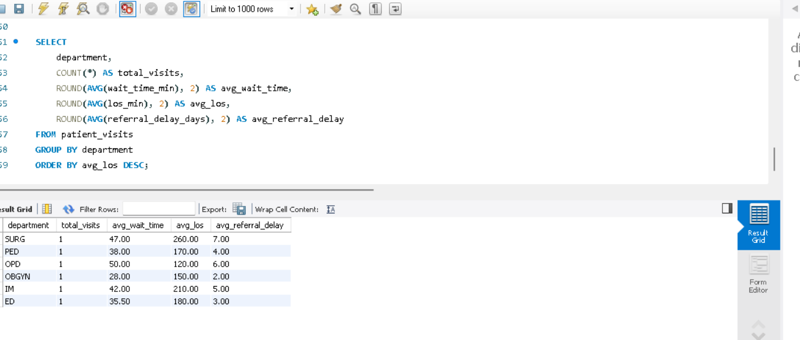

# 🏥 Healthcare Operations Performance Analysis

> Executive Analytics Portfolio Project — Generative AI Data Analyst Program

---

## 📌 Overview

This project analyzes **healthcare operational performance** using data analytics techniques to identify efficiency patterns, operational bottlenecks, and improvement opportunities. The analysis focuses on patient flow metrics — including **waiting time**, **length of stay (LOS)**, and **referral delays** — across multiple clinical departments.

A synthetic dataset of **5,000 patient visits** was used to simulate real-world healthcare operations. Tools included Microsoft Excel, pivot analysis, dashboard visualization, and AI-assisted insights generation.

---

## 👥 Developers

| Name | Role |
|---|---|
| **Mohammad Alshehri** | Prepare Data For Exploration |

**Program:** Generative AI Data Analyst — Vanderbilt University  
**Field:** Healthcare Data Analytics & AI  
**Year:** 2026

---

## 🛠️ Tools & Technologies

### Initial Tools
| Tool | Purpose |
|---|---|
| **Microsoft Excel** | Data cleaning, KPI calculation, pivot analysis |
| **Excel Dashboard** | Interactive visualization of KPIs |
| **Pivot Tables** | Department & monthly trend analysis |
| **AI (ChatGPT)** | Assisted interpretation of analytical findings |

### Enhanced Technical Stack ✨
| Technology | Version | Purpose |
|---|---|---|
| **Python** | 3.8+ | Advanced data analysis & automation |
| **Pandas** | 2.1.3 | Data manipulation & transformation |
| **NumPy** | 1.24.3 | Numerical computing & statistics |
| **Scikit-learn** | 1.3.2 | Machine learning & anomaly detection |
| **Plotly** | 5.17.0 | Interactive web-based visualizations |
| **Matplotlib/Seaborn** | 3.8.2/0.13.0 | Statistical plots & distributions |
| **SQLAlchemy** | 2.0.23 | Database ORM & integration |
| **Jupyter** | 1.0.0 | Interactive notebooks & exploration |
| **APScheduler** | 3.10.4 | Advanced job scheduling & automation |
| **Jinja2** | 3.1.2 | Dynamic report templating |
| **PyYAML** | 6.0.1 | Configuration management |
| **python-dotenv** | 1.0.0 | Environment variable management |

---

## 📊 Key Performance Indicators (KPIs)

| KPI | Value |
|---|---|
| ⏱️ Average Wait Time | **40.04 minutes** |
| 🛏️ Average Length of Stay (LOS) | **181.10 minutes** |
| 👥 Total Patient Visits | **5,000** |
| 📋 Average Referral Delay | **4.51 days** |

---

## 🔬 Methodology

The project followed a structured analytical workflow:

1. **Data Cleaning & Preparation** — Using Excel formulas to ensure data quality
2. **KPI Calculation** — Creating calculated performance indicators
3. **Department-Level Analysis** — Comparative analysis across ED, IM, OBGYN, OPD, PED, SURG
4. **Monthly Trend Analysis** — Tracking operational metrics across all 12 months of 2025
5. **Dashboard Visualization** — Executive-level interactive dashboard
6. **AI-Assisted Interpretation** — Using AI to surface actionable insights

---
## SQL Analytics Layer

To strengthen the analytical depth of the project, SQL was used as a structured querying layer to calculate and compare key operational performance indicators across departments.

This layer supported:
- KPI aggregation
- department-level performance comparison
- operational bottleneck identification
- trend-oriented analysis for decision support

### Sample SQL Output


In the sample output, departments were compared using:
- total visits
- average wait time
- average LOS
- average referral delay

This step demonstrates how raw healthcare visit data can be transformed into actionable operational insights using SQL.
## 📈 Key Findings

### Waiting Time
The overall average wait time was ~40 minutes, with small variation across departments — suggesting a **balanced patient intake process** without significant congestion at triage or registration.

### Length of Stay (LOS)
At ~181 minutes, LOS is significantly higher than wait time, indicating that **primary throughput delays occur within internal clinical processes** rather than at access points.

### Referral Delay
The average referral delay of ~4.5 days may contribute to prolonged patient management cycles and operational inefficiencies, affecting both outcomes and resource utilization.

### Department Comparison
Performance differences across departments were moderate with no single department showing extreme inefficiencies — suggesting **systemic rather than department-specific** challenges.

### Monthly Trends
Moderate fluctuations in wait time were observed through 2025, while LOS remained stable — indicating **consistent performance with minor seasonal variation**.

---

## 📸 Screenshots

**Dashboard Overview**


**Monthly Performance Trends**


---

## 💡 Recommendations

1. **Optimize Internal Clinical Processes** — Reduce LOS by improving diagnostic turnaround and care coordination workflows
2. **Enhance Referral Management** — Implement structured referral tracking to reduce delays and improve care continuity
3. **Deploy Real-Time KPI Monitoring** — Use live dashboards for proactive operational decision-making
4. **Leverage AI for Predictive Planning** — Forecast patient demand, resource utilization, and potential bottlenecks

---

## 🚀 Getting Started with Advanced Analytics

### Quick Start (Python)

1. **Setup Environment:**
   ```bash
   # Create virtual environment
   python -m venv .venv
   
   # Activate (Windows)
   .venv\Scripts\activate
   
   # Install dependencies
   pip install -r requirements.txt
   ```

2. **Generate Sample Data & Run Analysis:**
   ```bash
   # Basic statistical analysis
   python example_analysis.py
   ```

3. **Run Machine Learning Pipeline:**
   ```bash
   # Train predictive models
   python ml_pipeline_example.py
   
   # Explore use cases
   python ml_use_cases.py
   ```

4. **Comprehensive Financial & Clinical Analysis:**
   ```bash
   # Run expanded analytics with all metrics
   python expanded_analytics_example.py
   ```

5. **Automated Reporting & Scheduling:**
   ```bash
   # Run complete automation example
   python automation_example.py
   ```
   
   This will demonstrate:
   - ETL pipeline execution
   - Dynamic report generation
   - Quality metrics calculation
   - Job scheduling configuration
   - Report scheduling setup

6. **Explore with Jupyter:**
   ```bash
   jupyter notebook
   ```

### Project Structure
```
src/
├── analytics.py             # Core KPI calculations
├── visualization.py         # Advanced visualizations
├── machine_learning.py      # ML models & forecasting
├── financial_analytics.py   # Cost & ROI analysis
├── clinical_quality.py      # Quality & safety metrics
├── etl_pipeline.py          # ETL orchestration & data validation
├── reporting.py             # Dynamic report generation
├── scheduler.py             # Job scheduling & automation
└── generate_data.py         # Synthetic data generation

sql/
└── schema.sql               # Expanded database schema

data/
└── patient_visits.csv       # Sample dataset

docs/
├── TECHNICAL_GUIDE.md       # Technical documentation
├── ML_GUIDE.md              # Machine learning reference
├── DATA_DICTIONARY.md       # Complete field reference
└── AUTOMATION_GUIDE.md      # Automation setup & configuration (NEW!)

.env.example                 # Environment variable template (NEW!)
config.yaml                  # Job & automation configuration (NEW!)
example_analysis.py          # Statistics & visualization demo
ml_pipeline_example.py       # ML models & predictions demo
ml_use_cases.py              # Real-world ML scenarios
expanded_analytics_example.py # Financial & clinical analysis demo
automation_example.py        # Complete automation workflow demo (NEW!)
```

### Key Capabilities

✅ **Advanced Statistical Analysis**
- Anomaly detection (Z-score)
- Time series forecasting
- Correlation analysis
- Distribution analysis

✅ **Machine Learning Models** (Available)
- **Wait Time Prediction**: Gradient Boosting per department
- **Length of Stay Forecasting**: Random Forest ensembles
- **Referral Delay Prediction**: Global pattern detection
- **Patient Demand Forecast**: Monthly volume projections
- **Seasonality Detection**: Autocorrelation analysis

✅ **Financial Analytics**
- Cost breakdown by component (direct, supply, lab, imaging, pharmacy)
- Revenue analysis by insurance type
- Profitability metrics and ROI calculations
- Break-even analysis
- Cost-effectiveness evaluation
- Department profitability tracking

✅ **Clinical Quality Metrics**
- Readmission rate analysis (30-day)
- Adverse event tracking
- Mortality analysis by risk groups
- Patient satisfaction assessment
- Risk stratification (Low/Medium/High/Critical)
- Clinical outcome trajectories
- Comorbidity impact analysis

✅ **Interactive Visualizations**
- Department performance comparisons
- Trend analysis with rolling averages
- Distribution plots & box plots
- Heatmaps & correlation matrices

✅ **Data Pipeline Automation** (NEW!)
- **ETL Framework**: Extract, validate, transform, load workflows
- **Data Quality Checks**: Automated completeness, range, and category validation
- **Report Generation**: Dynamic HTML/PDF reports with Jinja2 templates
- **Job Scheduling**: APScheduler-based cron job orchestration
- **Quality Monitoring**: Automated health checks and alert triggers
- **Configuration Management**: YAML and environment-based configuration

✅ **Scheduled Automation** (NEW!)
- Daily ETL pipeline execution
- Weekly/monthly report generation
- Automated ML model retraining
- Continuous quality metric calculation
- Financial analysis automation
- Execution history tracking & monitoring

✅ **Expanded Data Dictionary**
- 50+ data fields covering operations, finance, and clinical metrics
- Realistic distributions and relationships
- Risk scoring algorithms
- Quality indicators framework

✅ **Database Integration**
- SQL schema for persistent storage
- SQLAlchemy ORM for Python
- Pre-built analytics views
- Financial and quality reporting tables

For detailed technical guide, see [TECHNICAL_GUIDE.md](docs/TECHNICAL_GUIDE.md)  
For automation guide, see [AUTOMATION_GUIDE.md](docs/AUTOMATION_GUIDE.md)

---

## ✅ Conclusion

This project demonstrates how **data analytics combined with AI-assisted interpretation** can support healthcare operational decision-making. While patient access processes appear efficient, improvement opportunities exist within internal care workflows and referral coordination.

The developed dashboard provides a **scalable framework** adaptable to real healthcare environments to improve efficiency, resource allocation, and patient experience.

---

## 📄 License

This project is licensed under the MIT License — see the [LICENSE](LICENSE) file for details.

---

> 💡 *"Better data = Faster decisions = Better healthcare."*
