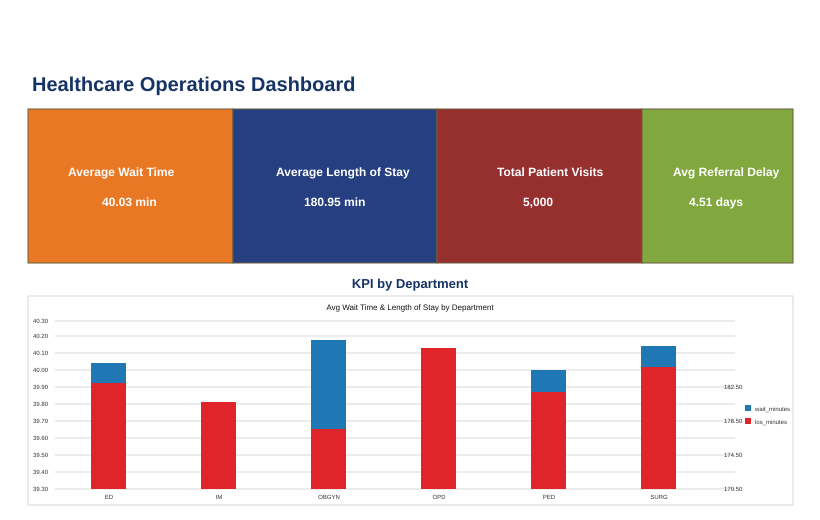
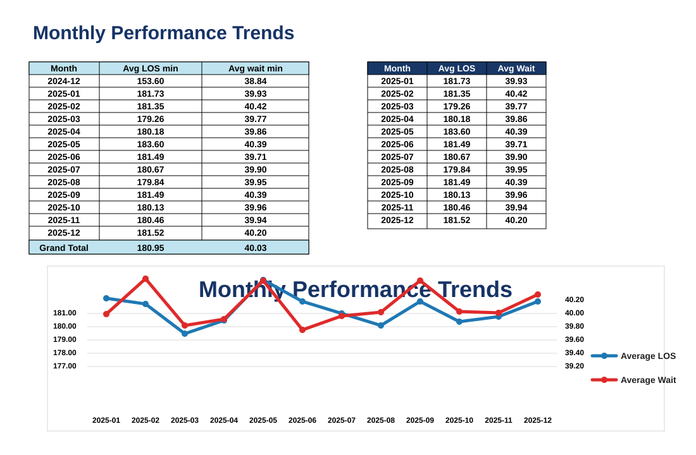
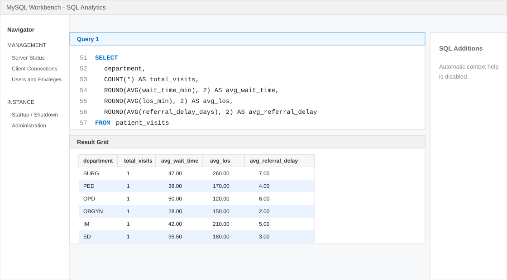
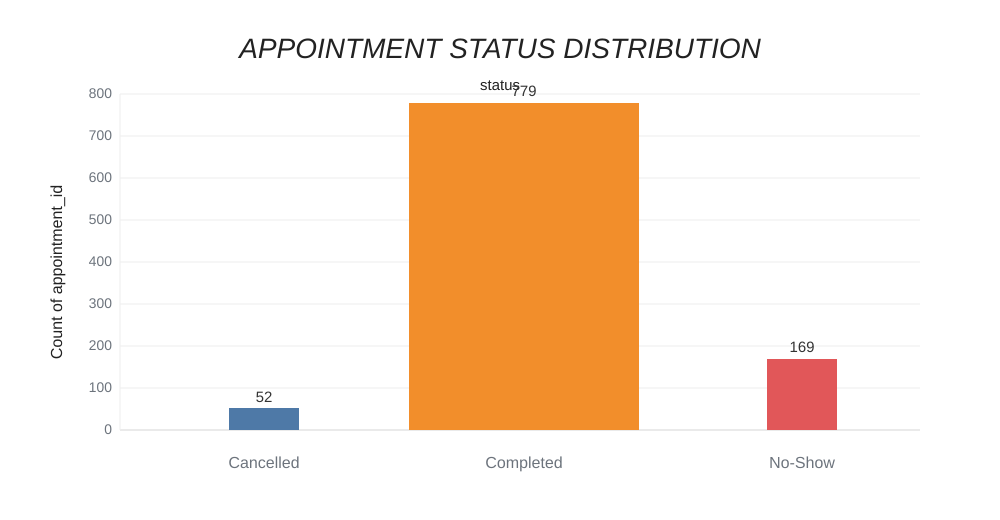
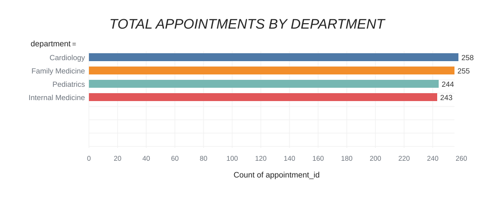

# Healthcare Operations Performance Analysis

Executive analytics portfolio project for healthcare operations, focused on patient flow, department performance, and monthly operational trends.

## Overview

This project analyzes healthcare operational performance using Excel, SQL, and Python. The analysis focuses on wait time, length of stay, patient visit volume, and referral delays across six clinical departments: ED, IM, OBGYN, OPD, PED, and SURG.

The core dataset is synthetic and contains 5,000 patient visits. It is intended for analytics practice, dashboard design, SQL aggregation, and AI-assisted interpretation. It must not be treated as real patient data.

## Project Context

| Field | Detail |
|---|---|
| Project Owner | Mohammad Alshehri |
| Role | Prepare Data For Exploration |
| Program | Generative AI Data Analyst, Vanderbilt University |
| Field | Healthcare Data Analytics and AI |
| Year | 2026 |

## Dataset

The project includes the source dashboard export at [data/healthcare visit.csv](data/healthcare%20visit.csv). This semicolon-delimited file is an Excel dashboard export that contains KPI card values and department-level metrics.

A cleaned department summary is also available at [data/department_kpi_summary.csv](data/department_kpi_summary.csv):

| Department | Wait Minutes | LOS Minutes |
|---|---:|---:|
| ED | 40.05 | 181.04 |
| IM | 39.63 | 180.60 |
| OBGYN | 40.19 | 179.94 |
| OPD | 40.12 | 181.86 |
| PED | 40.02 | 180.81 |
| SURG | 40.15 | 181.43 |

The full synthetic patient-level dataset can be generated with `python src/generate_data.py`, which creates `data/patient_visits.csv`.

## Dashboard Outputs





## SQL Analytics

The SQL layer aggregates operational KPIs by department and supports department-level performance comparison.

```sql
SELECT
    department,
    COUNT(*) AS total_visits,
    ROUND(AVG(wait_time_min), 2) AS avg_wait_time,
    ROUND(AVG(los_min), 2) AS avg_los,
    ROUND(AVG(referral_delay_days), 2) AS avg_referral_delay
FROM patient_visits
GROUP BY department
ORDER BY avg_los DESC;
```



SQL output highlights from the displayed Workbench result grid:

| Department | Total Visits | Avg Wait Time | Avg LOS | Avg Referral Delay |
|---|---:|---:|---:|---:|
| SURG | 1 | 47.00 | 260.00 | 7.00 |
| PED | 1 | 38.00 | 170.00 | 4.00 |
| OPD | 1 | 50.00 | 120.00 | 6.00 |
| OBGYN | 1 | 28.00 | 150.00 | 2.00 |
| IM | 1 | 42.00 | 210.00 | 5.00 |
| ED | 1 | 35.50 | 180.00 | 3.00 |

## Tableau Visualizations

These Tableau worksheets summarize the appointment sample by status and department.





Tableau summary values:

| View | Main Result |
|---|---|
| Appointment Status Distribution | Completed: 779, No-Show: 169, Cancelled: 52 |
| Total Appointments by Department | Cardiology: 258, Family Medicine: 255, Pediatrics: 244, Internal Medicine: 243 |

## Key KPIs

| KPI | Value |
|---|---:|
| Average Wait Time | 40.03 min |
| Average Length of Stay | 180.95 min |
| Total Patient Visits | 5,000 |
| Average Referral Delay | 4.51 days |

## Tools and Technologies

| Tool | Purpose |
|---|---|
| Microsoft Excel | Data cleaning, KPI calculation, pivot tables, dashboard visualization |
| MySQL Workbench | SQL query execution and result-grid validation |
| Tableau | Appointment status and department comparison worksheets |
| SQL | Department-level KPI aggregation and operational comparison |
| Python | Advanced analytics, automation, visualization, and synthetic data generation |
| Pandas and NumPy | Data manipulation and statistical calculations |
| Plotly, Matplotlib, Seaborn | Interactive and static visualizations |
| Scikit-learn | Machine learning examples and predictive modeling |

## Advanced Capabilities

- KPI aggregation and department-level operational comparison
- Monthly trend analysis for wait time and length of stay
- Statistical analysis, anomaly detection, and forecasting examples
- Machine learning examples for wait time, length of stay, referral delay, and demand forecasting
- Financial analytics for cost, revenue, profitability, and ROI scenarios
- Clinical quality metrics for readmissions, adverse events, mortality, satisfaction, and risk stratification
- ETL, reporting, scheduling, and automation examples

## Methodology

1. Clean and prepare healthcare visit data.
2. Calculate operational KPIs.
3. Compare performance across departments.
4. Analyze monthly trends for wait time and length of stay.
5. Build executive-level dashboard visuals.
6. Use AI-assisted interpretation to identify improvement opportunities.

## Key Findings

Average wait time is close to 40 minutes, with limited variation across departments. This suggests that patient intake is relatively balanced and that major delays are less likely to be concentrated at registration or triage.

Average length of stay is much higher than wait time, at roughly 181 minutes. This points to internal clinical workflow, diagnostics, care coordination, or discharge processes as likely throughput constraints.

Average referral delay is 4.51 days. Better referral tracking and follow-up workflows could reduce care-cycle delays and improve continuity of care.

Monthly trends show moderate movement in both wait time and length of stay, but no severe instability across 2025.

## Recommendations

1. Improve diagnostic turnaround and internal care coordination to reduce length of stay.
2. Implement structured referral tracking to reduce referral delays.
3. Monitor KPIs continuously through dashboards instead of relying only on periodic reports.
4. Use predictive analytics to forecast demand, resource pressure, and possible bottlenecks.

## Quick Start

Install dependencies:

```bash
pip install -r requirements.txt
```

Generate a full synthetic patient visit dataset:

```bash
python src/generate_data.py
```

Run the example analysis:

```bash
python example_analysis.py
```

Run the machine learning examples:

```bash
python ml_pipeline_example.py
python ml_use_cases.py
```

Run the expanded analytics example:

```bash
python expanded_analytics_example.py
```

Run the automation workflow example:

```bash
python automation_example.py
```

## Project Structure

```text
src/
  analytics.py              Core KPI calculations
  visualization.py          Advanced visualizations
  machine_learning.py       ML models and forecasting
  financial_analytics.py    Cost and ROI analysis
  clinical_quality.py       Quality and safety metrics
  etl_pipeline.py           ETL orchestration and data validation
  reporting.py              Dynamic report generation
  scheduler.py              Job scheduling and automation
  generate_data.py          Synthetic data generation

sql/
  schema.sql                Database schema and analytics layer

data/
  healthcare visit.csv      Excel dashboard export used for the KPI visuals
  department_kpi_summary.csv Clean department KPI summary extracted from the dashboard export
  patient_visits.csv        Generated synthetic dataset, created by src/generate_data.py

tableau-appointment-status-distribution.svg
tableau-department-comparison.svg
sql-analytics-output.svg

docs/
  TECHNICAL_GUIDE.md
  ML_GUIDE.md
  DATA_DICTIONARY.md
  AUTOMATION_GUIDE.md
```

## Documentation

- [Technical Guide](docs/TECHNICAL_GUIDE.md)
- [Machine Learning Guide](docs/ML_GUIDE.md)
- [Data Dictionary](docs/DATA_DICTIONARY.md)
- [Automation Guide](docs/AUTOMATION_GUIDE.md)

## License

This project is licensed under the MIT License. See [LICENSE](LICENSE) for details.
